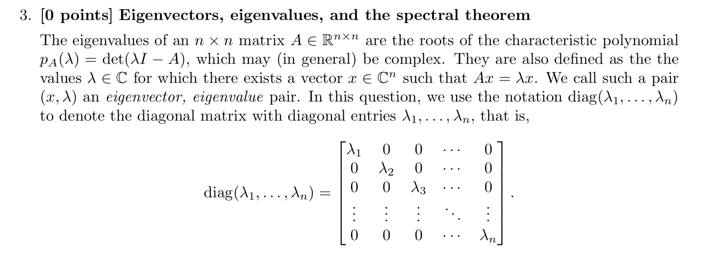

# 
cs229: Problem Set 0

### Answer:

$$ \nabla f(x)=\nabla\left(\frac{1}{2}\mathbf{x}^{\top}\mathbf{A}\mathbf{x}+\mathbf{b}^{\top} \mathbf{b}\right) $$
$$=\frac{1}{2}\left(\mathbf{A}+\mathbf{A}^{\top}\right) \mathbf{x}+\mathbf{b}$$
$$=\mathbf{A} \mathbf{x}+\mathbf{b}$$

$$ \nabla_{x} f(x)=\nabla_{x} g(h(x)) $$
$$ = \frac{\partial f}{\partial g} \nabla_{x}h(\mathbf{x}) $$

### Answer:
$$ f(x)=\frac{1}{2} \mathbf{x}^{T} \mathbf{A} \mathbf{x}+\mathbf{b}^{T} x $$
$$ \nabla f(x) = \frac{1}{2}\left(\mathbf{A}+\mathbf{A}^{T}\right) \mathbf{x}+\mathbf{b} $$
$$ \nabla^{2} f(x) =\nabla_{\mathbf{x}}\left(\frac{1}{2}(\mathbf{A}+\mathbf{A}^{T}) \mathbf{x}+\mathbf{b}\right)$$
$$ \nabla^{2} f(x) = \nabla_{\mathbf{x}}\left( (\mathbf{A})\mathbf{x} + \mathbf{b} \right) $$
$$ \nabla^{2} f(x)= \mathbf{A} $$

### 1st Derivative:
$$ \nabla_x{f(x)}=\nabla_x{g}\left(\mathbf{a}^{T} \mathbf{x}\right) $$
$$ \frac{\partial f}{\partial x} = \frac{\partial g}{\partial\left(\mathbf{a}^{T} \mathbf{x}\right)} \frac{\partial \left(\mathbf{a}^{T} \mathbf{x}\right)}{\partial x} $$
$$ = \nabla_x{g}\left(\mathbf{a}^{T} \mathbf{x}\right) \mathbf{a} $$

### 2nd Derivative:
$$ = \nabla{\left(\nabla f(x)\right)} $$
$$ \nabla{\left(\nabla f(x)\right)} = \nabla_{\mathbf{x}}\left( \mathbf{a} \nabla{g} \left( \mathbf{a}^T \mathbf{x} \right) \right) $$
$$ = \mathbf{a}  \mathbf{a}^T \nabla^{2} g(\mathbf{a}^T \mathbf{x}) $$

### Answer:
$$ A = \mathbf{z} \mathbf{z}^T $$
$$
\mathbf{z} \mathbf{z}^T = \begin{bmatrix} 
    z_{1}  \\
    \vdots \\
    z_{n}  
    \end{bmatrix}
    \begin{bmatrix} z_{1} \dots z_{n}  
    \end{bmatrix}
    = \begin{bmatrix} 
    z_{1} z_{1} & z_{1} z_{2} & \dots \\
    z_{2} z_{1} & z_{2} z_{2} & \dots \\
    \vdots & \ddots &  \\
    z_{N} z_{1} &  \dots      & z_{N} z_{N} 
    \end{bmatrix}
    \implies \mathbf{A} = \mathbf{A}^T
    \mathbf{x}^T A \mathbf{x} = \mathbf{x}^T \mathbf{z} \mathbf{z}^T \mathbf{x} 
$$
$$
    \mathbf{B} := \mathbf{z}^T \mathbf{x}
$$
$$
    \mathbf{x}^T A \mathbf{x} = \mathbf{B}^T \mathbf{B} = \Vert{B}\Vert_2^2
$$

### Answer:
Null-space of A: $$ \mathbf{x}^T A \mathbf{x} = 0 $$
$$\implies \mathbf{x}^T z = 0 $$
$$\implies \mathbf{x} \perp \mathbf{z} $$

### Answer:
If $\mathbf{B} \mathbf{A} \mathbf{B}^T $ is PSD
then $ \mathbf{x}^{\top} \mathbf{B}^{} \mathbf{A}^{} \mathbf{B}^{\top} \mathbf{x}^{} \geq 0 $
$$ \mathbf{u} := \mathbf{x}^{\top} \mathbf{B}^{}\hspace{1ex} where \hspace{1ex} \mathbf{u}^{} \in \mathbb{R}^{m} $$
$$ \mathbf{x}^{\top} \mathbf{B}^{} \mathbf{A}^{} \mathbf{B}^{\top} \mathbf{x}^{} = \mathbf{u}^{} \mathbf{A}^{} \mathbf{u}^{\top} $$
$$ \implies \mathbf{u}^{} \mathbf{A}^{} \mathbf{u}^{\top} \geq 0^{} $$

### Answer:
$$ \mathbf{A} = \mathbf{T} \mathbf{\Lambda} \mathbf{T}^{-1} $$
$$ \mathbf{A} \mathbf{T} =  \mathbf{T} \mathbf{\Lambda} \mathbf{T}^{-1} \mathbf{T} $$
$$ \mathbf{A} \mathbf{T} =  \mathbf{T} \mathbf{\Lambda} $$
$$ \mathbf{A} \mathbf{T} =  \mathbf{\Lambda} \mathbf{T}  \hspace{1ex}\hspace{1ex}\hspace{1ex}because\hspace{1ex}\Lambda\hspace{1ex}is\hspace{1ex}diagonal\hspace{1ex}matrix\hspace{1ex}\hspace{1ex}$$

### Answer:
If $\mathbf{U}$ is orthogonal $\implies \mathbf{U}^{-1} = \mathbf{U}^{\top}$
$$ \mathbf{A} \mathbf{U} = \mathbf{U} \mathbf{\Lambda} \mathbf{U}^{\top} \mathbf{U} $$
$$ = \mathbf{U} \mathbf{\Lambda} \mathbf{U}^{-1} \mathbf{U} $$
$$ = \mathbf{U} \mathbf{\Lambda} $$
$$ =  \mathbf{\Lambda} \mathbf{U} $$

(because $\Lambda$ is diagonal matrix)

### Answer:
$$\mathbf{A}\hspace{1ex}is\hspace{1ex}PSD,\hspace{1ex}\implies\mathbf{x}^{}\mathbf{A}^{}\mathbf{x}^{\top} \geq 0 $$
$$ = \mathbf{x}^{}\hspace{1ex}\mathbf{U}^{}\mathbf{\Lambda}^{}\mathbf{U}^{\top}\hspace{1ex}\mathbf{x}^{\top} \geq 0 $$
$$ \mathbf{y}^{} := \mathbf{x}^{\top}\mathbf{u}^{} $$
$$ \mathbf{x}^{}\mathbf{U}^{}\mathbf{\Lambda}^{}\mathbf{U}^{\top}\mathbf{x}^{\top} = \mathbf{y}^{}\mathbf{\Lambda}^{}\mathbf{y}^{\top}\hspace{1ex} $$
$$ \mathbf{y}^{}\mathbf{\Lambda}^{}\mathbf{y}^{\top}= \sum_{i=1}^{n} \lambda_{i}y_i^{2}\hspace{1ex},\hspace{2ex}where \hspace{1ex} y_i^{2}\geq 0 \hspace{1ex} and \hspace{1ex} \hspace{1ex}\forall{i} $$
$$ \implies \lambda_{i}\geq 0 \hspace{1ex}\hspace{1ex}\forall{i} $$
